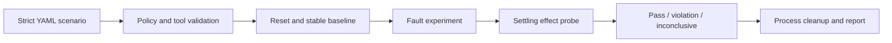

# HalfAck

**Fault-injection contract testing for state-changing MCP tools.**

HalfAck answers one narrow, expensive question: _if a tool changes state but the client cannot
trust the acknowledgement, will the logical operation happen exactly once?_

A successful mutation and its response do not arrive atomically. The server can durably create an
order, charge a test account, or enqueue a job, then lose the response before the client receives
it. The client sees an unknown outcome and may retry. Without a stable idempotency contract, that
retry can repeat the side effect.

HalfAck launches a disposable stdio MCP target, injects seven ambiguity patterns around one
state-changing call, and measures the resulting effect through target-provided reset and probe
tools. It reports a pass only when the fault was actually established, the observed value settled
at the declared oracle, and cleanup evidence is safe enough to continue.

> [!CAUTION]
> HalfAck deliberately invokes state-changing and reset tools. Use it only against an isolated,
> disposable test target and disposable external state. A scenario's `disposable: true` value is a
> required declaration, not a sandbox or proof of safety.

## Why another MCP test tool?

The official [MCP conformance suite](https://github.com/modelcontextprotocol/conformance) checks
protocol behavior. The official [MCP Inspector](https://github.com/modelcontextprotocol/inspector)
helps developers inspect and invoke servers interactively. HalfAck complements both: it tests an
application-level effect contract under lost responses, retries, cancellation, concurrency, and
process boundaries.

This distinction matters because protocol-valid behavior does not by itself make a mutation
idempotent. The
[GitHub MCP Scripts specification](https://github.github.com/gh-aw/reference/mcp-scripts-specification/)
also treats retries of non-idempotent calls as a caller-side concern and recommends idempotency
safeguards. HalfAck supplies a repeatable way to exercise and record those safeguards.

## The seven experiments

Every experiment starts with a unique `${run.id}` scope, resets that scope, and waits for a stable
baseline before injecting its fault.

| Experiment                                | Injected ambiguity                                                                                                                    | Passing observation                                                                            |
| ----------------------------------------- | ------------------------------------------------------------------------------------------------------------------------------------- | ---------------------------------------------------------------------------------------------- |
| `suppress_completed_response`             | Intercept a successful tool response after the target completed the call.                                                             | The final effect equals `oracle.once`.                                                         |
| `retry_new_id`                            | Suppress the first successful response, then retry the same logical operation with a new JSON-RPC request ID.                         | Both attempts together still produce `oracle.once`.                                            |
| `rpc_id_reuse`                            | Suppress the first response, terminate the direct target process, start a fresh process, and retry with the same JSON-RPC request ID. | External state survives the boundary and remains `oracle.once`.                                |
| `restart_after_suppressed_response`       | Suppress the first response, restart the direct target, and retry with a new request ID.                                              | External state survives the boundary and remains `oracle.once`.                                |
| `parallel_new_ids`                        | Send two concurrent calls with different request IDs but the same logical idempotency scope.                                          | The converged effect is `oracle.once`.                                                         |
| `cancel_on_progress`                      | Wait for matching progress, write `notifications/cancelled`, and observe the cancelled attempt.                                       | The full window ends stably at `oracle.cancelledEffect`.                                       |
| `disconnect_after_request_write_accepted` | Disconnect after the request write is accepted locally, then restart and retry with a new ID.                                         | The final effect is `oracle.once`, regardless of whether the first request reached the target. |

An experiment is **inconclusive**, not passing, when HalfAck cannot prove the intended fault
boundary.

## How it works



HalfAck evaluates experiments sequentially. Each one gets a fresh logical run ID, captures attempt
and fault evidence, and samples the probe for the complete configured observation window. For
external persistence, cleanup first terminates the experiment process, then opens a fresh observer
to recheck the durable result before reset. This prevents a delayed mutation from being hidden by
an early stable sample or by cleanup.

Pass-critical probe phases also require one fresh confirmation read that starts at or after the
observation boundary. Pre-boundary reads are capped at that boundary and cannot substitute for the
confirmation. The confirmation gets one `timeouts.requestMs` budget, so a full-window settle can
take up to `probe.settle.timeoutMs + timeouts.requestMs`; an absent, late, or unstable confirmation
is inconclusive rather than pass.

## Requirements

- Node.js **22.13.0 or newer**
- pnpm **11.5.0** for source development
- A stdio MCP target implementing the configured exercise, reset, and probe tools
- Disposable external persistence for restart, disconnect, and RPC-ID-reuse experiments

## Install and run

### npm

For a published package release:

```console
npm install --global halfack@0.1.0
halfack --version
halfack validate my-tool.halfack.yml
halfack run my-tool.halfack.yml
```

### npx

Run a published release without a global install:

```console
npx --yes halfack@0.1.0 validate my-tool.halfack.yml
npx --yes halfack@0.1.0 run my-tool.halfack.yml --format json
```

The scenario and its relative target paths must exist in your workspace. A packaged release
includes the runnable `examples` directory; copy it out of `node_modules` before running it so its
disposable state is written to your workspace:

```console
npm install --save-dev halfack@0.1.0
node -e "require('node:fs').cpSync('node_modules/halfack/examples','halfack-example',{recursive:true})"
npx halfack run halfack-example/duplicate-order.halfack.yml
```

### From source

From an existing HalfAck checkout:

```console
npm install --global pnpm@11.5.0
pnpm install --frozen-lockfile
pnpm build
node dist/cli/main.js validate examples/duplicate-order.halfack.yml
node dist/cli/main.js run examples/duplicate-order.halfack.yml
```

During development, the equivalent source command is:

```console
pnpm halfack run examples/duplicate-order.halfack.yml
```

## Runnable duplicate-order example

The repository includes an idempotent MCP server backed by durable marker files. The scenario
passes the same `${run.id}` as `clientToken` to every logically equivalent create attempt.

```console
pnpm build
node dist/cli/main.js run examples/duplicate-order.halfack.yml
```

For a machine-readable report:

```console
node dist/cli/main.js run examples/duplicate-order.halfack.yml --format json
```

To create a report file:

```console
node dist/cli/main.js run examples/duplicate-order.halfack.yml --format json --output halfack-report.json
```

`--output` is create-only: HalfAck atomically reserves the final path before starting the
experiment and refuses to overwrite an existing path.

The example stores its disposable markers under `.halfack/example-state` beside the repository's
`examples` directory. Remove that test state only when no HalfAck example process is running.

## Scenario format

This is the complete example configuration:

```yaml
schema: halfack/v1
name: duplicate-order
description: Detect duplicate order creation after an acknowledged response is lost.
target:
  transport: stdio
  protocol: 2026-07-28
  command: node
  args:
    - ./server.mjs
    - --state-dir
    - ../.halfack/example-state
  cwd: .
  envAllowlist:
    - PATH
    - SystemRoot
persistence: external
exercise:
  tool: orders.create
  arguments:
    clientToken: ${run.id}
reset:
  tool: test.reset
  arguments:
    scope: ${run.id}
probe:
  tool: orders.count
  arguments:
    scope: ${run.id}
  pointer: /structuredContent/count
  settle:
    timeoutMs: 4000
    intervalMs: 250
    stableSamples: 2
oracle:
  baseline: 0
  once: 1
  cancelledEffect: 0
experiments:
  - suppress_completed_response
  - retry_new_id
  - rpc_id_reuse
  - restart_after_suppressed_response
  - parallel_new_ids
  - cancel_on_progress
  - disconnect_after_request_write_accepted
safety:
  disposable: true
  processBoundary: single-process
timeouts:
  requestMs: 15000
  shutdownMs: 3000
```

### Field reference

| Field                        | Meaning                                                                                                                                                                 |
| ---------------------------- | ----------------------------------------------------------------------------------------------------------------------------------------------------------------------- |
| `schema`                     | Must be `halfack/v1`. Unknown fields are rejected.                                                                                                                      |
| `name`                       | Safe scenario identifier used in reports and generated run IDs.                                                                                                         |
| `description`                | Optional human-readable description.                                                                                                                                    |
| `target.transport`           | Must be `stdio`; network transports are not supported in 0.1.0.                                                                                                         |
| `target.protocol`            | Must be `2026-07-28` for this scenario schema.                                                                                                                          |
| `target.command`             | One executable, without embedded arguments. Use `target.args` for arguments.                                                                                            |
| `target.args`                | Arguments passed directly to the executable; defaults to `[]`.                                                                                                          |
| `target.cwd`                 | Existing working directory relative to the scenario file; defaults to `.` and cannot escape through `..` or a symlink.                                                  |
| `target.envAllowlist`        | Explicit subset of HalfAck's safe host-environment allowlist passed to the target; defaults to `[]`.                                                                    |
| `persistence`                | `external` when effect state survives target-process replacement; `process` only for experiment sets that do not require a restart boundary.                            |
| `exercise`                   | State-changing MCP tool and its arguments.                                                                                                                              |
| `reset`                      | Tool that returns the current run scope to `oracle.baseline`. It must be safe to call during cleanup.                                                                   |
| `probe`                      | Read-only tool invocation used to measure the effect.                                                                                                                   |
| `probe.pointer`              | RFC 6901 JSON Pointer rooted at `/structuredContent`; the selected value must be a safe integer.                                                                        |
| `probe.settle.timeoutMs`     | Full observation window for each probe phase, default `2000`; a stable sample never ends it early, and pass-critical phases then perform a fresh boundary confirmation. |
| `probe.settle.intervalMs`    | Delay between probe samples, default `100`, and shorter than the timeout.                                                                                               |
| `probe.settle.stableSamples` | Consecutive equal samples required for stability, default `2`.                                                                                                          |
| `oracle.baseline`            | Expected value immediately after reset.                                                                                                                                 |
| `oracle.once`                | Expected value after one logical operation; it must differ from `baseline`.                                                                                             |
| `oracle.cancelledEffect`     | Expected value after the cancellation experiment; required when `cancel_on_progress` is selected.                                                                       |
| `experiments`                | Unique, non-empty subset of the seven experiment names.                                                                                                                 |
| `safety.disposable`          | Must literally be `true`; this records operator intent but does not isolate the target.                                                                                 |
| `safety.processBoundary`     | Must be `single-process`; see the safety boundary below.                                                                                                                |
| `timeouts.requestMs`         | Per-request/fault deadline, default `3000`.                                                                                                                             |
| `timeouts.shutdownMs`        | Direct-process shutdown evidence deadline, default `1000`.                                                                                                              |

`${run.id}` is the only supported placeholder. It may appear recursively in tool argument values,
but not in object keys, executable paths, target arguments, working directories, tool names, probe
pointers, or environment names. HalfAck expands it independently for each experiment, allowing the
reset, exercise, and probe tools to share one disposable logical scope.

Scenarios are strict UTF-8 YAML 1.2 files with a 256 KiB limit. Anchors and aliases are rejected.
Use `halfack validate <scenario.yml>` to check configuration and target paths without starting the
target process.

## CLI and automation

```text
halfack run <scenario.yml> [--format human|json] [--output <path>]
halfack validate <scenario.yml>
halfack --help
halfack --version
```

- `--format human` is the default and emits one concise line per experiment.
- `--format json` emits the versioned `halfack/report/v1` envelope.
- Without `--output`, the report goes to stdout and diagnostics go to stderr.
- With `--output`, HalfAck reserves a new regular file before target execution and writes the
  completed report through that exact file handle; it never replaces an existing path. An abrupt
  host crash can leave the reserved file empty or incomplete.
- `SIGINT` and `SIGTERM` request bounded cleanup and return exit code `130`.

### Exit codes

|  Code | Meaning                                                  |
| ----: | -------------------------------------------------------- |
|   `0` | Every reported experiment passed and cleanup was proven. |
|   `1` | At least one contract violation was observed.            |
|   `2` | Invalid command-line usage or output path.               |
|   `3` | Scenario read, parse, policy, or validation failure.     |
|   `4` | Target failure or an inconclusive suite.                 |
|  `70` | Unexpected internal HalfAck failure.                     |
| `130` | Interrupted by `SIGINT` or `SIGTERM`.                    |

## Report semantics

HalfAck keeps three outcomes intentionally separate:

- **Pass** means the requested fault was proven, the complete observation window ended stably at
  the expected oracle, a fresh boundary confirmation agreed, and required cleanup/process evidence
  is consistent.
- **Violation** means a proven experiment settled at a value different from its expected oracle.
- **Inconclusive** means the target, probe, fault injection, cancellation, settling, termination, or
  cleanup evidence was insufficient. Inconclusive is never promoted to pass.

Suite status precedence is `violation`, then `inconclusive`, then `pass`. A cleanup failure or a
halted suite is inconclusive unless a violation has already been established. `halted: true` means
later configured experiments were not evaluated, typically because HalfAck could not prove it was
safe to spawn another direct target.

JSON reports include tool and schema versions, generated time, suite counts, per-experiment run
IDs, attempt outcomes, fault receipts, sampled probe evidence, cleanup evidence, and direct-process
termination observations. Probe evidence is bounded; the report records dropped sample counts when
truncation occurs.

## Safety boundary

HalfAck's safeguards are conservative, but they are not containment:

- `safety.disposable: true` is an assertion made by the scenario author. HalfAck cannot prove the
  target, credentials, database, queue, or downstream API is disposable.
- Process-boundary experiments require `persistence: external`, because the effect oracle must
  survive replacement of the direct target process.
- Restart, disconnect, and RPC-ID-reuse experiments require a **direct executable**. Known shells
  and launchers such as `sh`, `cmd`, PowerShell, `wsl`, `docker`, `podman`, `npm`, `pnpm`, `npx`,
  `yarn`, `uvx`, and `tsx` are rejected.
- `processBoundary: single-process` means HalfAck observes and terminates only the direct process it
  spawned. A confirmed result proves that direct process exited and its stdio closed.
- It does **not** prove termination of a process tree, child or detached processes, containers,
  remote workers, queued jobs, or downstream side effects. It does not make any of those resources
  safe to reset.
- Launcher detection is defense in depth, not identity proof: a renamed or custom launcher cannot
  be recognized reliably. The target author remains responsible for the declared single-process
  boundary.
- The locally accepted write in the disconnect experiment proves only the client-side transport
  boundary. It does not prove that the server read or committed the request.

Use dedicated test credentials, a target that spawns no children, an isolated external store, and
a reset tool scoped by `${run.id}`. Never point HalfAck at production.

## Current limitations

HalfAck 0.1.0 intentionally has a narrow boundary:

- stdio targets only; no HTTP, SSE, container, remote-host, or orchestrator integration
- MCP protocol `2026-07-28` only, using `server/discover`; there is no legacy `initialize`
  handshake or protocol-version fallback
- one direct target process, with no process-tree containment
- one numeric safe-integer probe selected from MCP `structuredContent`
- target-defined reset semantics rather than snapshots or database rollback
- exact-effect assertions (`baseline`, `once`, and optional `cancelledEffect`), not arbitrary
  predicates
- external durability is observed through the probe, not verified inside the target's transaction
  or storage engine
- cancellation testing requires a matching progress notification and cooperative cancellation
  behavior
- every effect claim is bounded by the configured observation window; HalfAck cannot prove that an
  undeclared external worker will never mutate state later
- experiments run sequentially; HalfAck does not model distributed clients, clocks, or network
  partitions
- JSON report schema `halfack/report/v1` is versioned, but no long-term compatibility promise is
  made before 1.0

## Development

```console
pnpm install --frozen-lockfile
pnpm typecheck
pnpm lint
pnpm format:check
pnpm test
pnpm build
pnpm package:smoke
```

Run a focused test during development:

```console
pnpm exec vitest run test/experiment/runner-integration.test.ts
```

The project uses strict TypeScript, ESLint, Prettier, and Vitest. Production paths contain no
placeholder implementations; behavior changes should include tests for success, ambiguity, and
failure paths.

## Contributing and security

Contributions are welcome; see [CONTRIBUTING.md](CONTRIBUTING.md) for the development workflow.
Report suspected vulnerabilities privately by following [SECURITY.md](SECURITY.md).

## License

[MIT](LICENSE)
